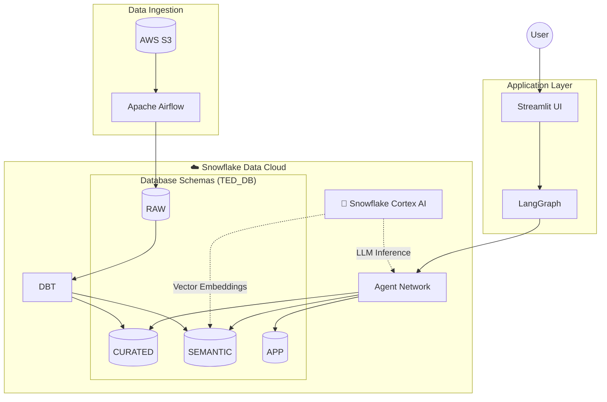
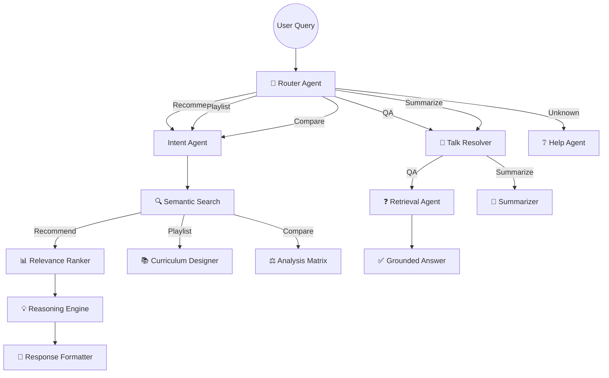
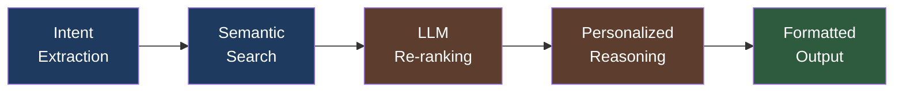
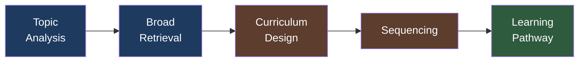
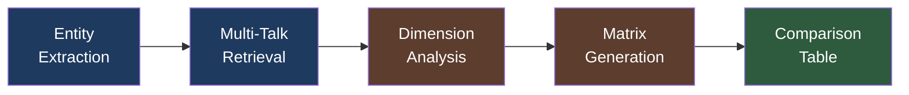
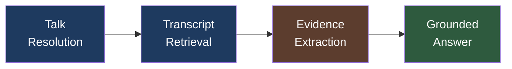

<div align="center">

# 🧠 TED AI Curator

### An Intelligent Multi-Agent System for TED Talk Discovery & Analysis

[](https://www.python.org/downloads/)
[](https://www.snowflake.com/)
[](https://github.com/langchain-ai/langgraph)
[](https://streamlit.io/)

*Discover, compare, and learn from TED Talks using AI-powered semantic search and multi-agent orchestration.*

</div>

---

## 📖 Table of Contents

- [Overview](#-overview)
- [Key Features](#-key-features)
- [System Architecture](#-system-architecture)
- [Agent Pipelines](#-agent-pipelines)
- [Technology Stack](#-technology-stack)
- [Project Structure](#-project-structure)
- [Getting Started](#-getting-started)
- [Usage Examples](#-usage-examples)
- [Security](#-security)

---

## 🎯 Overview

**TED AI Curator** is an enterprise-grade AI assistant that transforms how users discover and engage with TED Talk content. Built on a **Retrieval-Augmented Generation (RAG)** architecture, the system combines:

- **Semantic Vector Search** for concept-based discovery
- **Multi-Agent Orchestration** via LangGraph for complex reasoning
- **Snowflake Cortex** for scalable LLM inference
- **Modern Data Engineering** with Airflow + DBT

> 💡 *"Not just search—intelligent curation."*

---

## ✨ Key Features

| Feature | Description |
|---------|-------------|
| **🔍 Semantic Search** | Find talks by concept, not keywords. "AI ethics" finds relevant content even without exact matches. |
| **📚 Learning Playlists** | Generate structured curriculums: Foundations → Core → Advanced |
| **⚖️ Talk Comparison** | Side-by-side analysis of speakers, themes, and presentation styles |
| **❓ Grounded Q&A** | Ask questions about specific talks with evidence-backed answers |
| **📝 Video Summaries** | Get key takeaways from any talk's transcript |
| **💬 Chat Persistence** | Auto-saved conversations with LLM-generated titles |
| **👤 Personalization** | Saved playlists and search history tracking |

---

## 🏗️ System Architecture

### High-Level Overview



### Agent Orchestration (LangGraph)

The system employs a **Hub-and-Spoke** architecture with a central Router Agent directing traffic to specialized pipelines:



---

## 🔄 Agent Pipelines

### 1. Recommendation Pipeline
*"Show me inspiring talks about leadership"*



**Agents Involved:**
1. **Intent Agent** - Extracts topics, subtopics, and user goals
2. **Search Agent** - Performs hybrid vector + keyword retrieval
3. **Ranking Agent** - LLM-based re-ranking for relevance
4. **Reasoning Agent** - Generates "Why this talk?" explanations
5. **Formatter Agent** - Structures the final response

---

### 2. Playlist Generator
*"Create a learning path for quantum computing"*



**Output Structure:**
- 📗 **Foundations** - Introductory concepts
- 📘 **Core Concepts** - Essential knowledge
- 📕 **Advanced** - Deep dives and cutting-edge ideas

---

### 3. Comparison Agent
*"Compare Simon Sinek's talk with Brené Brown's"*



**Comparison Dimensions:**
| Dimension | Description |
|-----------|-------------|
| Focus | Practical vs. Theoretical |
| Audience | Beginner vs. Expert |
| Tone | Motivational vs. Analytical |
| Key Insight | Core takeaway |

---

### 4. QA & Summarization Pipeline
*"What does Bill Gates say about climate change?"*



**Key Innovation:** Answers are **grounded** in transcript evidence. No hallucinations—if it's not in the talk, the system says so.

---

## 🛠️ Technology Stack

| Layer | Technology | Purpose |
|-------|------------|---------|
| **Database** | Snowflake | Data warehouse with vector search |
| **AI/LLM** | Snowflake Cortex | `llama3.1-405b`, `snowflake-arctic-embed-m` |
| **Orchestration** | Apache Airflow | ETL pipeline automation |
| **Transformation** | DBT | SQL-based data modeling |
| **Agent Framework** | LangGraph | Multi-agent state machine |
| **Frontend** | Streamlit | Interactive chat interface |
| **Storage** | AWS S3 | Raw data lake |

---

## 📂 Project Structure

```
ted_ai_project/
│
├── 📁 airflow/                    # Data Orchestration
│   ├── dags/                      # Airflow DAG definitions
│   │   ├── s3_ingest_dag.py       # S3 upload automation
│   │   ├── dbt_snowflake_dag.py   # DBT execution
│   │   └── scraper.py             # TED data scraper
│   └── docker-compose.yml         # Airflow infrastructure
│
├── 📁 dbt/                        # Data Transformation
│   ├── models/
│   │   ├── staging/               # Raw → Clean
│   │   ├── curated/               # Clean → Enriched
│   │   └── semantic/              # Embeddings layer
│   └── profiles/                  # Connection config
│
├── 📁 snowflake/                  # Database Setup (IaC)
│   └── final_ddl/                 # Consolidated schemas
│       ├── 01_raw.sql
│       ├── 02_curated.sql
│       ├── 03_semantic.sql
│       └── 04_app.sql
│
├── 📁 streamlit_app/              # Frontend Application
│   ├── app.py                     # Main entry point
│   ├── langgraph_agents.py        # Agent definitions
│   └── db.py                      # Snowflake client
│
└── 📁 common/                     # Shared utilities
```

---

## 🚀 Getting Started

### Prerequisites

- Python 3.10+
- Snowflake Account (with Cortex enabled)
- Docker (for Airflow)
- AWS Account (for S3)

### 1. Clone & Setup Environment

```bash
git clone https://github.com/your-repo/ted_ai_project.git
cd ted_ai_project

# Create virtual environment
python -m venv .venv
source .venv/bin/activate  # or .venv\Scripts\activate on Windows

# Install dependencies
pip install -r requirements.txt
```

### 2. Configure Environment Variables

Create a `.env` file in the root directory:

```env
# Snowflake
SNOWFLAKE_ACCOUNT=your_account
SNOWFLAKE_USER=your_user
SNOWFLAKE_ROLE=TRAINING_ROLE
SNOWFLAKE_WAREHOUSE=TED_AGENT_WH
SNOWFLAKE_DATABASE=TED_DB
SNOWFLAKE_SCHEMA=APP
SNOWFLAKE_PRIVATE_KEY_PATH=./dbt/snowflake_key.pem

# AWS (for S3)
AWS_ACCESS_KEY_ID=your_key
AWS_SECRET_ACCESS_KEY=your_secret
S3_BUCKET=your_bucket
```

### 3. Initialize Database

Run the DDL scripts in Snowflake:

```sql
-- Execute in order
@snowflake/final_ddl/01_raw.sql
@snowflake/final_ddl/02_curated.sql
@snowflake/final_ddl/03_semantic.sql
@snowflake/final_ddl/04_app.sql
```

### 4. Run the Application

```bash
cd streamlit_app
streamlit run app.py
```

Open `http://localhost:8501` in your browser.

---

## 💬 Usage Examples

| Query | Agent Activated |
|-------|-----------------|
| "Best talks on AI ethics" | Recommendation Pipeline |
| "Learn data science step by step" | Playlist Generator |
| "Compare Elon Musk and Bill Gates" | Comparison Agent |
| "What did Ken Robinson say about creativity?" | QA Pipeline |
| "Summarize the TED talk 'Do schools kill creativity'" | Summarization Agent |

---

## 🛡️ Security

- **Secrets Management**: All credentials stored in `.env` (git-ignored)
- **Key-Pair Auth**: Snowflake uses RSA key authentication
- **RBAC**: Least-privilege `TRAINING_ROLE` for all operations
- **No Hardcoded Keys**: Verified clean codebase

---

<div align="center">

**Built with ❤️ for the TED AI Project**

*Northeastern University | DAMG 7245*

</div>
