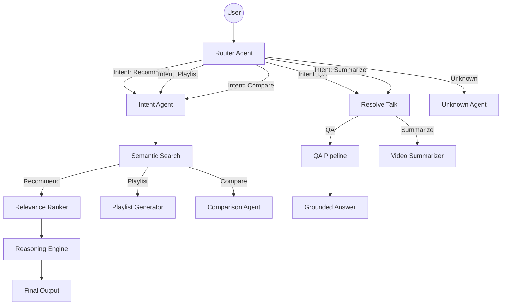
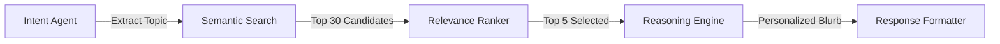
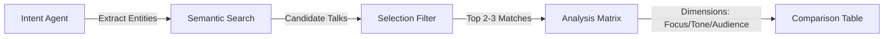
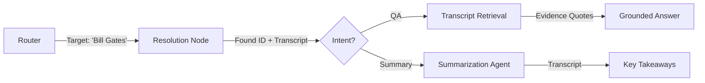

# 🧠 TED AI Curator & Personal Assistant

An intelligent, multi-agent AI system designed to curate, recommend, and analyze TED Talks. Built with **Snowflake Cortex**, **LangGraph**, and **Airflow**, this project demonstrates a modern **RAG (Retrieval-Augmented Generation)** architecture suitable for enterprise-grade applications.

---

## 🏗️ Architecture

The system follows a **Hub-and-Spoke** agentic architecture orchestrated by LangGraph, where specialized sub-graphs handle complex tasks:



### 🧠 Agent Network (Multi-Agent System)

1.  **Router Agent**: The central dispatcher that analyzes user urgency and intent to effectively route queries.
2.  **Recommendation Pipeline (5-Step Chain)**:
    *   **Intent Agent**: Disambiguates vague queries (e.g., "inspiring talks" -> "Leadership/Motivation").
    *   **Semantic Search**: performing hybrid retrieval on vector embeddings.
    *   **Relevance Ranker**: An LLM-based re-ranker that filters noise.
    *   **Reasoning Engine**: Generates personalized "Why this talk?" explanations.
    *   **Formatter**: Structures the output for the UI.
3.  **Playlist Generator Agent**: A hierarchical agent that acts as a curriculum designer. It first retrieves a pool of candidates, then logically groups them into "Foundations", "Core Concepts", and "Advanced" modules.
4.  **Comparison Agent**: A sophisticated analyst agent that:
    *   **Filters**: Selects the top 2-3 most relevant talks.
    *   **Analyzes**: Extracts dimensions (Focus, Audience, Tone).
    *   **Synthesizes**: Produces a side-by-side comparison matrix.
5.  **QA & Summarization Pipeline**:
    *   **Resolution Node**: First identifies *which* talk the user is asking about.
    *   **Retrieval Agent**: Scans the full transcript to find evidence quotes.
    *   **Grounded Answer Agent**: Synthesizes an answer using *only* the retrieved evidence to prevent hallucinations.

---

## 🚀 Features

*   **Semantic Search**: Find talks by concept (e.g., "AI ethics") not just keywords.
*   **Smart Recommendations**: Get personalized "Why this talk?" explanations for every suggestion.
*   **Structured Learning Paths**: Generate curated playlists for complex topics (e.g., "Beginner's Guide to Quantum Physics").
*   **Talk Comparison**: "Compare the talk by Simon Sinek vs. Brene Brown" – get a structured analysis of themes and styles.
*   **Chat Persistence**: Auto-saves your conversations and organizes them by title (generated by LLM).
*   **User Personalization**: Tracks watch history and favorites to refine future recommendations.

---

## � Detailed Agent Workflows

### 1. Recommendation Pipeline
Designed for discovery (`"Show me talks about AI"`).


### 2. Playlist Generator
Designed for structured learning (`"Create a learning path for Physics"`).
```mermaid
graph LR
    Intent[Intent Agent] -->|Extract Topic| Search[Semantic Search]
    Search -->|Broad Pool (40+)| Designer[Curriculum Designer]
    Designer -->|Select 7| Found[Step 1: Foundations]
    Designer -->|Select 7| Core[Step 2: Core Concepts]
    Designer -->|Select 7| Adv[Step 3: Advanced]
    Found & Core & Adv --> Final[Formatted Playlist]
```

### 3. Comparison Agent
Designed for analysis (`"Compare Sinek vs Brown"`).


### 4. QA & Summarization Pipeline
Designed for specific video interaction (`"What does Bill Gates say about X?"`).


---

## �🛠️ Technology Stack

*   **Database**: Snowflake (Data Warehousing, Vector Search)
*   **AI/LLM**: Snowflake Cortex (`llama3.1-405b`, `snowflake-arctic-embed-m`)
*   **Orchestration**: Apache Airflow
*   **Transformation**: DBT (Data Build Tool)
*   **Agent Framework**: LangGraph / LangChain
*   **Frontend**: Streamlit
*   **Language**: Python 3.10+

---

## 📂 Project Structure

```bash
ted_ai_project/
├── airflow/               # Airflow DAGs & Scripts
│   ├── dags/              # ETL Pipelines (S3 Ingestion, Scrapers)
│   └── docker-compose.yml # Airflow Infrastructure
├── dbt/                   # DBT Project
│   ├── models/            # SQL Models (Staging, Curated, Semantic)
│   └── profiles/          # Connection Profiles
├── snowflake/             # Database Infrastructure (IaC)
│   └── final_ddl/         # Consolidated DDL for all schemas
├── streamlit_app/         # Frontend Application
│   ├── app.py             # Main Entry Point
│   ├── langgraph_agents.py# AI Agent Definitions (The "Brain")
│   └── db.py              # Snowflake Interaction Layer
└── common/                # Shared Utilities
```

---

## ⚡ Setup & Usage

### Prerequisites
*   Python 3.10+
*   Snowflake Account (with Cortex enabled)
*   Docker (for Airflow)

### 1. Environment Setup
Create a `.env` file in the root directory (see `.env.example`):
```text
SNOWFLAKE_ACCOUNT=...
SNOWFLAKE_USER=...
SNOWFLAKE_PASSWORD=...
SNOWFLAKE_ROLE=TRAINING_ROLE
SNOWFLAKE_WAREHOUSE=TED_AGENT_WH
SNOWFLAKE_DATABASE=TED_DB
SNOWFLAKE_SCHEMA=APP
```

### 2. Run the Application
Navigate to the app directory and launch Streamlit:
```bash
cd streamlit_app
pip install -r requirements.txt
streamlit run app.py
```

### 3. (Optional) Run Airflow Pipeline
To trigger a fresh data ingestion:
```bash
cd airflow
docker-compose up -d
# Access Airflow UI at localhost:8080 (admin/admin)
```

---

## 🛡️ Security

*   **Credentials**: All sensitive keys are managed via `.env` files and strictly excluded from version control.
*   **RBAC**: Snowflake access is governed by the `TRAINING_ROLE` with least-privilege access.
*   **Public Key Auth**: Snowflake connections use Key-Pair authentication where possible for enhanced security.
